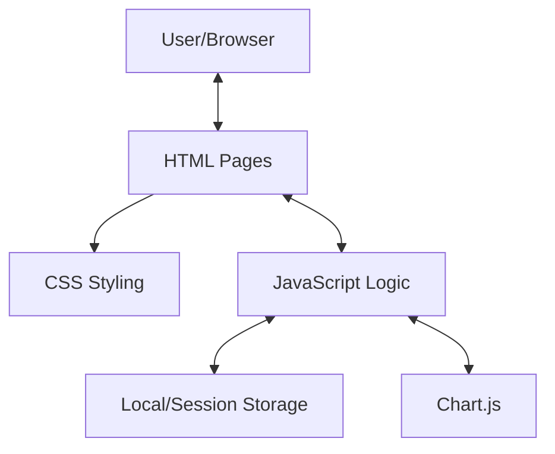
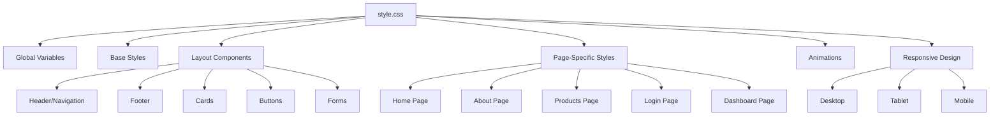
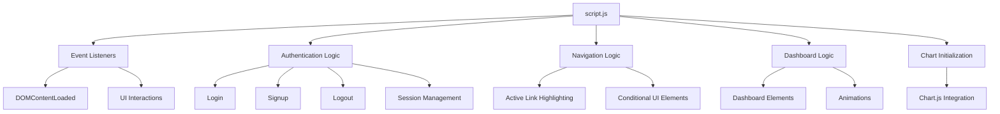
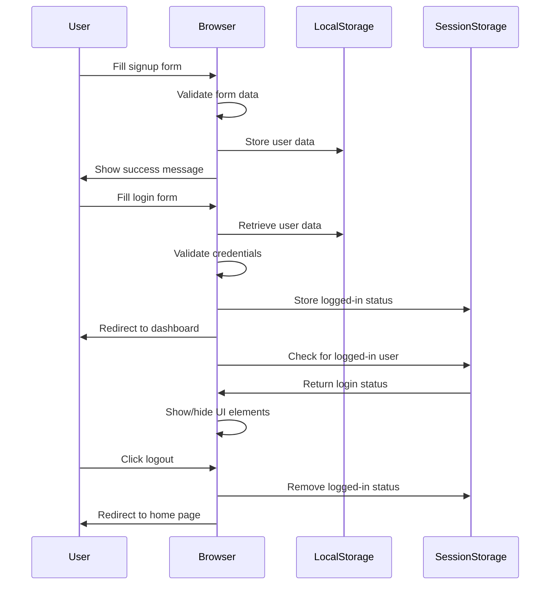
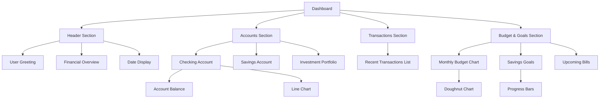

# FinDash: Comprehensive Documentation

This document provides detailed information about the structure, functionality, and implementation details of the FinDash application. It's designed to help developers understand the codebase and make modifications as needed.

## Table of Contents

1. [Project Overview](#project-overview)
2. [Architecture](#architecture)
3. [HTML Structure](#html-structure)
4. [CSS Architecture](#css-architecture)
5. [JavaScript Functionality](#javascript-functionality)
6. [Authentication System](#authentication-system)
7. [Dashboard Implementation](#dashboard-implementation)
8. [Data Visualization](#data-visualization)
9. [Responsive Design](#responsive-design)
10. [Components Reference](#components-reference)
11. [Best Practices](#best-practices)
12. [Troubleshooting](#troubleshooting)

## Project Overview

FinDash is a client-side financial dashboard application built with HTML, CSS, and JavaScript. It provides users with tools to monitor their finances, track expenses, set savings goals, and manage budgets. The application uses a combination of local storage and session storage to maintain user data and authentication state.

The application follows a multi-page architecture with each page serving a specific purpose:
- `index.html`: Home page with marketing content
- `about.html`: About the company and team
- `products.html`: Products and services offered
- `login.html`: User authentication (login and signup)
- `dashboard.html`: Main financial dashboard (authenticated access only)

## Architecture

FinDash follows a simple client-side architecture with no server-side components. User data is stored locally in the browser.



In this architecture:
- HTML files provide the structure and content
- CSS handles the presentation and layout
- JavaScript manages user interactions, data handling, and dynamic content
- Local/Session Storage stores user data and authentication state
- Chart.js is used for data visualization components

## HTML Structure

### Common HTML Structure

All pages in FinDash follow a consistent structure:

```html
<!DOCTYPE html>
<html lang="en">
<head>
    <!-- Meta tags, title, and stylesheets -->
</head>
<body>
    <header>
        <!-- Navigation bar -->
    </header>
    
    <main class="main-content">
        <!-- Page-specific content -->
    </main>
    
    <footer>
        <!-- Footer content -->
    </footer>
    
    <!-- JavaScript files -->
</body>
</html>
```

### Page-Specific Structure

#### Header Component

The header contains the navigation menu:

```html
<header>
    <nav class="navbar">
        <a href="index.html" class="logo">
             FinDash
        </a>
        <ul class="nav-links">
            <li><a href="index.html">Home</a></li>
            <li><a href="about.html">About Us</a></li>
            <li><a href="products.html">Products & Services</a></li>
            <li><a href="login.html" id="login-nav-link">Login/SignUp</a></li>
            <li><a href="dashboard.html" id="dashboard-nav-link" style="display: none;">Dashboard</a></li>
            <li><button id="logout-button" style="display: none;">Logout</button></li>
        </ul>
    </nav>
</header>
```

Key HTML elements:
- `nav.navbar`: The main navigation container
- `.logo`: The website logo and name
- `.nav-links`: List of navigation links
- Conditional elements:
  - `#login-nav-link`: Shown only to non-authenticated users
  - `#dashboard-nav-link`: Shown only to authenticated users
  - `#logout-button`: Shown only to authenticated users

#### Footer Component

The footer contains site information and links:

```html
<footer>
    <div class="footer-content">
        <div class="footer-logo">
            <a href="index.html">FinDash</a>
            <p>Simplifying financial management for everyone</p>
        </div>
        <div class="footer-links">
            <!-- Footer columns with links -->
        </div>
    </div>
    <div class="footer-bottom">
        <p>© 2023 FinDash. All rights reserved.</p>
        <div class="social-icons">
            <!-- Social media icons -->
        </div>
    </div>
</footer>
```

#### Dashboard Page

The dashboard page has a more complex structure:

```html
<main class="main-content" id="dashboard-content">
    <!-- Dashboard Header -->
    <div class="dashboard-header">
        <!-- Greeting and stats -->
    </div>
    
    <!-- Dashboard Content -->
    <div class="dashboard-content">
        <!-- Accounts Section -->
        <section class="dashboard-section">...</section>
        
        <!-- Transactions Section -->
        <section class="dashboard-section">...</section>
        
        <!-- Budget & Goals Section -->
        <section class="dashboard-section">...</section>
    </div>
</main>

<!-- Auth Message (shown if not logged in) -->
<div id="auth-message" class="auth-required-message" style="display: none;">
    <!-- Authentication message -->
</div>
```

## CSS Architecture

FinDash uses a comprehensive CSS file (`style.css`) with a modular approach to styling different components.

### CSS Organization



### CSS Variables

FinDash uses CSS custom properties (variables) to maintain a consistent design system:

```css
:root {
    /* Colors */
    --primary-color: #4a90e2;
    --accent-color: #50e3c2;
    --dark-text: #333333;
    --light-text: #7c8798;
    --secondary-color: #5e6c84;
    --light-bg: #ffffff;
    --border-color: #e6e9ef;
    
    /* Shadows */
    --shadow: 0 4px 12px rgba(0, 0, 0, 0.1);
    --shadow-light: 0 2px 8px rgba(0, 0, 0, 0.05);
    --shadow-heavy: 0 8px 24px rgba(0, 0, 0, 0.12);
}
```

These variables are used throughout the codebase for consistency.

### Important CSS Components

#### 1. Layout System

FinDash uses both flexbox and grid layouts:

```css
/* Flexbox Example */
.navbar {
    display: flex;
    justify-content: space-between;
    align-items: center;
    padding: 1rem 5%;
}

/* Grid Example */
.dashboard-grid {
    display: grid;
    grid-template-columns: repeat(auto-fit, minmax(300px, 1fr));
    gap: 2rem;
}
```

#### 2. Component Styling

Cards, buttons, and other UI components have consistent styling:

```css
/* Card Styling */
.dashboard-card {
    background-color: var(--light-bg);
    border-radius: 12px;
    box-shadow: var(--shadow);
    border: 1px solid var(--border-color);
    padding: 1.5rem;
    transition: transform 0.3s ease, box-shadow 0.3s ease;
}

/* Button Styling */
.cta-button {
    display: inline-block;
    background: linear-gradient(90deg, var(--primary-color) 0%, #6a8fe2 100%);
    color: white;
    font-weight: 600;
    padding: 0.8rem 1.5rem;
    border-radius: 50px;
    text-decoration: none;
    transition: transform 0.3s ease, box-shadow 0.3s ease;
}
```

#### 3. Animations

FinDash uses CSS animations for UI elements:

```css
/* Fade-in Animation */
.fade-in {
    opacity: 0;
    transform: translateY(20px);
    transition: opacity 0.5s ease, transform 0.5s ease;
}

.fade-in.visible {
    opacity: 1;
    transform: translateY(0);
}

/* Pulse Animation */
@keyframes pulse {
    0% { transform: scale(1); }
    50% { transform: scale(1.05); }
    100% { transform: scale(1); }
}

.pulse {
    animation: pulse 2s infinite;
}
```

#### 4. Responsive Design

Media queries ensure the site works well on all device sizes:

```css
/* Tablet Breakpoint */
@media (max-width: 1100px) {
    .hero {
        padding: 6rem 5%;
        flex-direction: column;
    }
    /* Other tablet adjustments */
}

/* Mobile Breakpoint */
@media (max-width: 768px) {
    .navbar {
        padding: 1rem 5%;
        flex-wrap: wrap;
    }
    /* Other mobile adjustments */
}
```

## JavaScript Functionality

FinDash uses JavaScript for various features and interactive elements. The main script file (`script.js`) handles the core functionality.

### JavaScript Organization



### Core JavaScript Functions

#### 1. Authentication System

```javascript
// Check Login Status
const loggedInUser = sessionStorage.getItem('loggedInUser');

if (loggedInUser) {
    // User is logged in - show/hide appropriate elements
    if (loginNavLink) loginNavLink.style.display = 'none';
    if (dashboardNavLink) dashboardNavLink.style.display = 'inline-block';
    if (logoutButton) logoutButton.style.display = 'inline-block';
} else {
    // User is not logged in
    if (dashboardNavLink) dashboardNavLink.style.display = 'none';
    if (logoutButton) logoutButton.style.display = 'none';
}

// Login Form Handler
loginForm.addEventListener('submit', (e) => {
    e.preventDefault();
    const username = document.getElementById('login-username').value.trim();
    const password = document.getElementById('login-password').value;
    
    // Validation and authentication logic
    const storedUserDataString = localStorage.getItem(username);
    
    if (storedUserDataString) {
        const storedUserData = JSON.parse(storedUserDataString);
        if (storedUserData.password === password) {
            // Set logged-in status
            sessionStorage.setItem('loggedInUser', username);
            // Redirect to dashboard
            window.location.href = 'dashboard.html';
        }
    }
});
```

The authentication system uses:
- `localStorage` to store user account information (persists beyond browser sessions)
- `sessionStorage` to maintain the logged-in state (cleared when browser is closed)

#### 2. Dashboard Logic

```javascript
// Dashboard Page Logic
if (currentPage === 'dashboard.html') {
    const dashboardContent = document.getElementById('dashboard-content');
    const authMessage = document.getElementById('auth-message');
    const dashboardUsernameSpan = document.getElementById('dashboard-username');

    if (loggedInUser) {
        // User is logged in, show dashboard content
        if (dashboardContent) dashboardContent.style.display = 'block';
        if (authMessage) authMessage.style.display = 'none';
        if (dashboardUsernameSpan) dashboardUsernameSpan.textContent = loggedInUser;
        
        // Dashboard animations
        const fadeElements = document.querySelectorAll('.fade-in');
        if (fadeElements.length > 0) {
            setTimeout(() => {
                fadeElements.forEach((element, index) => {
                    setTimeout(() => {
                        element.classList.add('visible');
                    }, 100 * index); // Staggered animation
                });
            }, 300);
        }
    } else {
        // User is not logged in, show auth message
        if (dashboardContent) dashboardContent.style.display = 'none';
        if (authMessage) authMessage.style.display = 'flex';
    }
}
```

#### 3. Chart Initialization

Chart.js is used to create interactive charts in the dashboard:

```javascript
// Sample Chart Initialization
const ctxChecking = document.getElementById('checkingChart')?.getContext('2d');
if (ctxChecking) {
    new Chart(ctxChecking, {
        type: 'line',
        data: {
            labels: ['Apr 15', 'Apr 22', 'Apr 29', 'May 6', 'May 13'],
            datasets: [{
                label: 'Balance ($)',
                data: [1800, 2400, 2100, 2560, 2500],
                borderColor: 'var(--primary-color)',
                backgroundColor: 'rgba(74, 144, 226, 0.1)',
                tension: 0.3,
                fill: true,
                borderWidth: 2,
                pointBackgroundColor: 'var(--primary-color)',
                pointRadius: 3
            }]
        },
        options: {
            responsive: true,
            maintainAspectRatio: false,
            plugins: {
                legend: { display: false },
                title: {
                    display: true,
                    text: 'Balance: $2,500',
                    align: 'start',
                    padding: { top: 10, bottom: 10 },
                    font: { size: 14, weight: '600' }
                }
            },
            scales: {
                // Scale configuration
            }
        }
    });
}
```

## Authentication System

FinDash implements a simple client-side authentication system. Here's how it works:



### Authentication Security Considerations

**Important Note:** The current implementation is for demonstration purposes only and has several security limitations:

1. Passwords are stored in plain text (not hashed)
2. Data is stored client-side and can be tampered with
3. No server-side validation of user input
4. No protection against cross-site scripting (XSS)

In a production environment, implement proper security practices:
- Hash passwords using bcrypt or similar
- Use a secure backend for user data storage
- Implement server-side validation
- Use JWT or secure cookie-based authentication
- Apply proper CSP (Content Security Policy) headers

## Dashboard Implementation

The dashboard page is the core of the FinDash application. It contains multiple sections displaying financial information.

### Dashboard Components



### Dashboard Stats Cards

The stats cards in the dashboard header provide a quick overview of financial status:

```html
<div class="dashboard-stats">
    <div class="dashboard-stat-card fade-in" style="animation-delay: 0.2s;">
        <div class="dashboard-stat-label">Total Balance</div>
        <div class="dashboard-stat-value">$19,000</div>
    </div>
    <div class="dashboard-stat-card fade-in" style="animation-delay: 0.3s;">
        <div class="dashboard-stat-label">Income (Monthly)</div>
        <div class="dashboard-stat-value">$3,750</div>
    </div>
    <div class="dashboard-stat-card fade-in" style="animation-delay: 0.4s;">
        <div class="dashboard-stat-label">Expenses (Monthly)</div>
        <div class="dashboard-stat-value">$2,340</div>
    </div>
</div>
```

### Account Cards

Each account card follows this structure:

```html
<div class="dashboard-card">
    <div class="dashboard-card-header">
        <h3>Checking Account</h3>
        <div class="dashboard-card-icon">
            <i class="fas fa-wallet"></i>
        </div>
    </div>
    <div class="chart-container">
        <canvas id="checkingChart"></canvas>
    </div>
</div>
```

### Transaction Items

Each transaction follows this structure:

```html
<li class="transaction-item">
    <div class="transaction-info">
        <div class="transaction-icon income">
            <i class="fas fa-arrow-down"></i>
        </div>
        <div class="transaction-details">
            <div class="transaction-name">Salary Deposit</div>
            <div class="transaction-date">May 1, 2023</div>
        </div>
    </div>
    <div class="transaction-amount income">+$3,750.00</div>
</li>
```

### Progress Bars

Savings goals use progress bars:

```html
<div class="goal-progress">
    <div class="goal-info">
        <div class="goal-name">Vacation Fund</div>
        <div class="goal-percentage">65%</div>
    </div>
    <div class="progress-bar">
        <div class="progress-fill" style="width: 65%"></div>
    </div>
    <p>$650 of $1,000 saved</p>
</div>
```

## Data Visualization

FinDash uses Chart.js for all data visualization. The application includes several types of charts:

### Chart Types and Implementations

1. **Line Charts**
   Used for account balance history
   
   ```javascript
   new Chart(ctxChecking, {
       type: 'line',
       data: {
           labels: ['Apr 15', 'Apr 22', 'Apr 29', 'May 6', 'May 13'],
           datasets: [{
               label: 'Balance ($)',
               data: [1800, 2400, 2100, 2560, 2500],
               borderColor: 'var(--primary-color)',
               backgroundColor: 'rgba(74, 144, 226, 0.1)',
               tension: 0.3,
               fill: true,
               // Other properties
           }]
       },
       options: {
           // Chart options
       }
   });
   ```

2. **Doughnut Charts**
   Used for budget allocation
   
   ```javascript
   new Chart(ctxBudget, {
       type: 'doughnut',
       data: {
           labels: ['Housing', 'Food', 'Transport', 'Entertainment', 'Savings'],
           datasets: [{
               data: [1200, 400, 150, 250, 500],
               backgroundColor: [
                   'rgba(74, 144, 226, 0.8)',
                   'rgba(80, 227, 194, 0.8)',
                   'rgba(245, 166, 35, 0.8)',
                   'rgba(126, 211, 33, 0.8)',
                   'rgba(189, 16, 224, 0.8)'
               ],
               // Other properties
           }]
       },
       options: {
           // Chart options
       }
   });
   ```

### Chart Customization

Charts are customized to match the FinDash design system:

1. **Colors**: Uses the application's color variables
2. **Fonts**: Matches the application's typography
3. **Responsive**: Adapts to different screen sizes
4. **Interactions**: Includes tooltips and hover effects

## Responsive Design

FinDash is fully responsive, adapting to different screen sizes from desktop to mobile.

### Responsive Design Implementation

1. **Fluid Layouts**
   Uses relative units (%, rem) and flexible layouts
   
   ```css
   .container {
       max-width: 1200px;
       width: 90%;
       margin: 0 auto;
   }
   ```

2. **Media Queries**
   Targets different screen sizes
   
   ```css
   /* Tablet */
   @media (max-width: 1100px) {
       /* Tablet-specific styles */
   }
   
   /* Mobile */
   @media (max-width: 768px) {
       /* Mobile-specific styles */
   }
   ```

3. **Responsive Grids**
   CSS Grid with auto-fit and minmax for adaptive layouts
   
   ```css
   .dashboard-grid {
       display: grid;
       grid-template-columns: repeat(auto-fit, minmax(300px, 1fr));
       gap: 2rem;
   }
   ```

4. **Flexible Images**
   Images scale with their container
   
   ```css
   img {
       max-width: 100%;
       height: auto;
   }
   ```

### Mobile Navigation

On smaller screens, the navigation adapts:

```css
@media (max-width: 768px) {
    .navbar {
        padding: 1rem 5%;
    }
    
    .nav-links {
        flex-direction: column;
        margin-top: 1rem;
        width: 100%;
    }
    
    .nav-links li {
        margin: 0.5rem 0;
    }
}
```

## Components Reference

### Button Variants

FinDash includes several button styles:

1. **Primary Button (CTA)**
   ```html
   <a href="#" class="cta-button">Get Started</a>
   ```
   
   ```css
   .cta-button {
       display: inline-block;
       background: linear-gradient(90deg, var(--primary-color) 0%, #6a8fe2 100%);
       color: white;
       font-weight: 600;
       padding: 0.8rem 1.5rem;
       border-radius: 50px;
       text-decoration: none;
       transition: transform 0.3s ease, box-shadow 0.3s ease;
   }
   ```

2. **Secondary Button**
   ```html
   <a href="#" class="secondary-button">Learn More <i class="fas fa-arrow-right"></i></a>
   ```
   
   ```css
   .secondary-button {
       display: inline-block;
       background-color: white;
       color: var(--primary-color);
       font-weight: 600;
       padding: 0.8rem 1.5rem;
       border-radius: 50px;
       text-decoration: none;
       border: 2px solid var(--primary-color);
       transition: all 0.3s ease;
   }
   ```

### Form Elements

Common form elements and their styles:

1. **Form Group**
   ```html
   <div class="form-group">
       <label for="login-username"><i class="fas fa-user"></i> Username</label>
       <input type="text" id="login-username" placeholder="Enter your username">
   </div>
   ```
   
   ```css
   .form-group {
       margin-bottom: 1.5rem;
   }
   
   .form-group label {
       display: block;
       margin-bottom: 0.5rem;
       font-weight: 500;
       color: var(--secondary-color);
   }
   
   .form-group input {
       width: 100%;
       padding: 0.8rem 1rem;
       border: 1px solid var(--border-color);
       border-radius: 8px;
       font-size: 1rem;
       transition: border-color 0.3s ease, box-shadow 0.3s ease;
   }
   ```

### Card Components

Different card components used throughout the application:

1. **Feature Card**
   ```html
   <div class="feature-item">
       <div class="feature-icon">
           <i class="fas fa-chart-pie"></i>
       </div>
       <h3>Expense Tracking</h3>
       <p>Monitor where your money goes with detailed categorization.</p>
       <a href="#" class="feature-link">Learn more <i class="fas fa-arrow-right"></i></a>
   </div>
   ```
   
   ```css
   .feature-item {
       background-color: var(--light-bg);
       padding: 2rem;
       border-radius: 12px;
       box-shadow: var(--shadow);
       transition: transform 0.3s ease, box-shadow 0.3s ease;
   }
   ```

2. **Testimonial Card**
   ```html
   <div class="testimonial-item">
       <div class="testimonial-rating">★★★★★</div>
       <p>"FinDash changed how I manage my finances. Now I have clear insights into my spending and saving patterns."</p>
       <div class="testimonial-author">
           
           <div>
               <h4>Jane Doe</h4>
               <p>Small Business Owner</p>
           </div>
       </div>
   </div>
   ```

3. **Dashboard Card**
   ```html
   <div class="dashboard-card">
       <div class="dashboard-card-header">
           <h3>Checking Account</h3>
           <div class="dashboard-card-icon">
               <i class="fas fa-wallet"></i>
           </div>
       </div>
       <div class="chart-container">
           <canvas id="checkingChart"></canvas>
       </div>
   </div>
   ```

## Best Practices

FinDash follows several front-end development best practices:

### 1. CSS Organization
- Uses CSS variables for consistent styling
- Follows a modular approach to CSS organization
- Prioritizes reusable components

### 2. JavaScript Structure
- Uses event delegation where appropriate
- Follows a modular approach to JavaScript functionality
- Uses modern JavaScript features (ES6+)

### 3. Performance Optimization
- Minimizes DOM manipulations
- Uses efficient CSS selectors
- Implements lazy loading for charts

### 4. Accessibility
- Uses semantic HTML elements
- Includes proper ARIA attributes
- Maintains sufficient color contrast
- Ensures keyboard navigability

### 5. Code Maintainability
- Uses consistent naming conventions
- Includes detailed comments
- Follows a consistent code style

## Troubleshooting

### Common Issues and Solutions

#### 1. Login Issues
- **Problem**: Unable to log in despite correct credentials
- **Solution**: Check if cookies or local storage is enabled in your browser

#### 2. Charts Not Displaying
- **Problem**: Charts are not visible in the dashboard
- **Solution**: Ensure Chart.js library is loaded correctly and the canvas elements have proper IDs

#### 3. Responsive Layout Issues
- **Problem**: Layout breaks on certain screen sizes
- **Solution**: Inspect the affected elements with browser developer tools and check if appropriate media queries are applied

#### 4. Animation Issues
- **Problem**: Animations not working or appearing janky
- **Solution**: Check if the browser supports the CSS properties used for animations
``` 